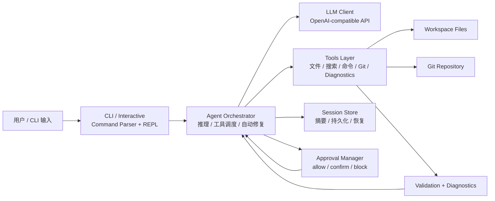
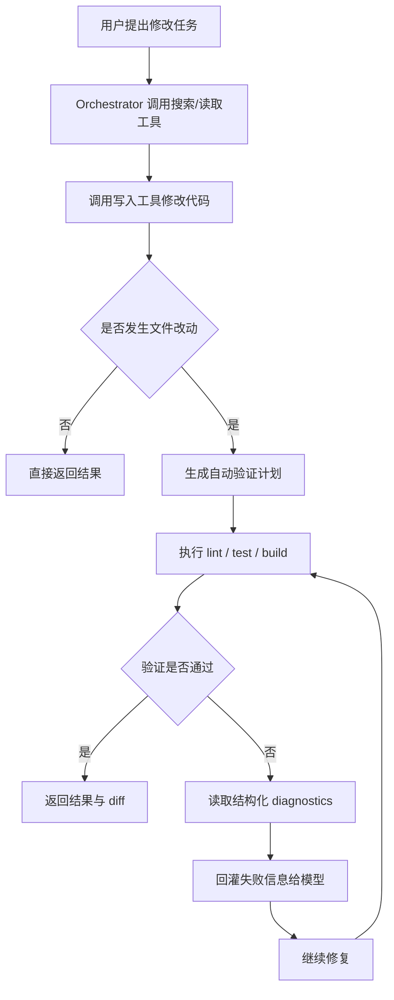

# Mini Claude Code

一个从零实现的本地 Code Agent CLI，具备完整的 LLM 工具调用闭环、多级安全策略、Git 工作流接入、结构化 diagnostics 和自动验证修复能力。

> 不是套壳聊天机器人，而是能真正完成“搜索 → 读取 → 修改 → 验证 → 提交”的本地代码助手。

**技术栈**：TypeScript · Node.js (ESM) · OpenAI SDK（兼容协议）· Commander · Zod · Vitest

## Why this project

- 面向真实开发流程，而不只是聊天问答
- 支持受控工具调用、安全审批、自动验证与自动修复
- 把 Git、diagnostics、session resume 都纳入 Agent 闭环
- 既能作为本地生产力工具，也适合作为工程化简历项目展示

## Highlights

- **Git-aware Agent**：支持 `git status`、`git diff`、`git log`、`git add`、`git commit`
- **Diagnostics-driven Auto-Fix**：验证失败后补充结构化 TypeScript / Biome diagnostics
- **Session Resume**：支持多会话持久化、会话列表、按 ID 恢复
- **Security-first Execution**：命令执行采用 allow / confirm / block 三级策略
- **Eval-ready Benchmarking**：内置 benchmark、隔离执行和前置条件检查

## Demo at a glance

- 修改代码 → 自动触发验证 → diagnostics 回灌 → 自动修复
- 查看仓库状态 → 总结 diff → 暂存指定文件 → 生成提交
- 中断会话 → 查看历史会话 → 按 ID 恢复上下文继续执行

## 总体架构图



## 修改任务执行流程



## Git 工作流图


## 会话恢复流程图


## 项目亮点

- **Git-aware Agent**：支持 `git status`、`git diff`、`git log`、`git add`、`git commit`，把版本控制纳入 agent 工作流
- **Diagnostics-driven Auto-Fix**：验证失败时不仅回灌 stdout/stderr，还会补充结构化 TypeScript / Biome diagnostics，提升自动修复定位能力
- **Session Resume**：支持多会话持久化、会话列表、按 ID 恢复，让长任务可以中断后继续
- **Security-first Execution**：命令执行采用 allow / confirm / block 三级策略，并配合外部路径确认和审计日志控制风险
- **Eval-ready Benchmarking**：内置 benchmark、隔离执行和前置条件检查，可持续评估 read / edit 类任务表现

## 适合简历的项目描述

> 实现了一个本地代码 Agent CLI，支持文件与搜索工具调用、安全审批、自动验证修复，并进一步接入 Git 工作流、结构化 diagnostics 和多会话恢复能力，使其更接近真实开发场景中的工程助手。

## 项目动机

市面上的 AI 编程工具大多是 IDE 插件或 Web 聊天界面，底层的 Agent 机制对开发者不透明。这个项目从第一行代码开始，独立实现了一个可在终端运行的 Code Agent，重点解决以下问题：

- **工具调用闭环**：不只是生成文本，而是让 LLM 自主调用文件操作、搜索、命令执行、Git、diagnostics 等工具，形成完整的任务执行链路
- **安全边界控制**：Agent 能执行命令、读写文件，如何在给予能力的同时守住安全底线
- **长会话上下文管理**：多轮对话中 token 预算有限，如何在裁剪历史时保留关键信息，并支持会话持久化与恢复
- **修改后的自动验证**：代码改完不能靠 LLM 自己说"改好了"，需要自动跑验证，并在失败时结合结构化 diagnostics 反馈修复

## 核心架构

```
src/
  cli/                 # CLI 入口与交互层
    index.ts             Commander 解析，单次执行 / 交互模式 / benchmark / 会话命令
    interactive.ts       多轮对话 REPL（Spinner、实时事件流、斜杠命令、确认交互）
    approval-log.ts      审批日志的格式化输出与过滤
    benchmark.ts         benchmark 输出与失败原因渲染
    sessions.ts          会话列表 / 详情输出
  agent/               # Agent 引擎（核心逻辑）
    orchestrator.ts      Agent Loop 主循环，调度 LLM、Git、diagnostics 与自动修复
    prompts.ts           系统提示词
    approval.ts          审批管理器（命令确认、外部路径 / 文件确认、审计记录）
    validation.ts        代码修改后的自动验证计划、diagnostics 补充与失败回灌
    summary.ts           长会话摘要压缩（基于焦点的上下文保留策略）
    session.ts           多会话持久化、索引与恢复
  llm/                 # LLM 通信层
    client.ts            OpenAI 兼容协议的流式 / 非流式调用封装
    env.ts               环境变量管理
  tools/               # 工具定义（10 个工具）
    filesystem.ts        8 个文件工具 + 外部文档提取引擎
    search.ts            文本搜索（ripgrep 优先，Node.js 遍历兜底）
    command.ts           命令执行（白名单 / 守卫 / 黑名单三级策略）
    create-tool.ts       工具工厂（zod 运行时校验 + JSON Schema 双重定义）
  types/               # 类型系统
    agent.ts             ChatMessage、ToolDefinition、AgentEvent 等核心类型
  utils/               # 基础设施
    token.ts             Token 估算与上下文窗口裁剪
    diff.ts              统一 diff 生成（LCS 算法 + 行内变更高亮）
    command-audit.ts     审批日志持久化（NDJSON 格式）
    logger.ts            终端输出（Spinner 动画、彩色 diff、事件日志）
```

**技术栈**：TypeScript · Node.js (ESM) · OpenAI SDK（兼容协议）· Commander · Zod · Vitest

## 关键设计决策

### 1. Agent Loop 与自适应执行预算

`orchestrator.ts` 实现了 LLM → 工具调用 → 结果回传 → 继续推理的核心循环。执行轮数不是固定值，而是根据任务类型动态调整：

- 写入 / 修复类任务：12 轮（改完即止）
- 只读分析任务：16 轮（需要更多探索）
- 外部文档分析：20 轮
- 外部项目 / 目录分析：24 轮

运行时还会检测实际行为：如果连续几轮都在调用只读工具，会自动上调预算，避免分析任务被过早截断。

```typescript
// orchestrator.ts — 运行时动态升级执行预算
const isReadOnlyExplorationTurn = toolNames.every((name) => READ_ONLY_TOOLS.has(name));
if (isReadOnlyExplorationTurn && !hasModifiedFiles && maxIterations < EXTERNAL_ANALYSIS_EXECUTION_ROUND_LIMIT) {
  maxIterations = upgradedBudget;
  steps.push(`执行预算已调整为 ${maxIterations} 轮（${budgetReason}）`);
}
```

### 2. 三级命令安全策略

`command.ts` 对所有命令执行请求做策略评估，返回 `allow` / `confirm` / `block` 三种决策：

| 层级 | 策略 | 示例 |
|------|------|------|
| **白名单** | 直接放行 | `ls`, `cat`, `git status`, `npm run build` |
| **守卫** | 需用户确认后执行 | `git push`, `npm install`, `node script.js` |
| **黑名单** | 直接拦截 | `rm -rf`, `sudo`, `curl\|sh`, shell 链式语法 |

在此基础上，还有三层额外防护：

- **环境变量扩展**：通过 `RUN_COMMAND_ALLOWLIST` / `GUARDLIST` / `BLOCKLIST` 自定义规则
- **Shell 语法拦截**：禁止 `&&`、`|`、`;`、`$()` 等链式 / 管道 / 命令替换语法，杜绝注入
- **审计日志**：所有审批决策（含自动验证触发的命令）持久化到 NDJSON 文件，支持按时间 / 类型 / 路径查询

### 3. 自动验证、diagnostics 与自动修复

当 Agent 修改了代码文件后，系统不依赖 LLM 自行判断正确性，而是：

1. **分析修改范围**：根据变更文件类型（源码 / 测试 / 配置 / 文档）决定需要运行哪些验证脚本
2. **自动执行验证**：依次运行 `lint` → `test` → `build`（仅运行项目中实际存在的脚本）
3. **结构化读取错误**：对于 `lint` / `build` 类失败，额外读取结构化 diagnostics，提取文件、行号、错误级别、错误码与消息
4. **失败时自动修复**：将错误摘要与 diagnostics 一并回灌给 LLM，要求它定位问题并修复，最多尝试 2 轮

```
代码修改 → 检测变更类型 → 选择验证脚本 → 执行验证
                                            ↓ 失败
                                    截取错误摘要 → 回灌 LLM → 修复代码 → 重新验证
                                                                        ↓ 仍失败
                                                                   第 2 轮修复 → 最终报告
```

文档文件（.md / .txt / .rst）的变更会自动跳过验证，避免不必要的构建。

### 4. 上下文管理：摘要压缩 + 焦点保留

长会话中旧消息会被裁剪，但不是简单丢弃，而是经过两步处理：

1. **结构化摘要**：被移除的消息按类型生成摘要行（如 `文件操作: write_file src/index.ts`、`命令结果: npm run build -> exit 0`）
2. **焦点评分**：维护一个动态更新的"焦点"（当前任务涉及的文件路径、搜索关键词），摘要行超出上限时，按与焦点的相关性打分排序，优先保留与当前工作相关的线索

这确保了 LLM 在后续轮次中仍然知道"之前做过什么"，而不是完全失去上下文。

### 5. 外部文档处理引擎

不只是操作工作区内的代码文件，还能安全地分析工作区外的各类文档：

| 格式 | 提取方式 |
|------|----------|
| `.docx` / `.doc` / `.odt` / `.rtf` | macOS `textutil` 原生转换 |
| `.xlsx` / `.xlsm` / `.xltx` | 解压 OOXML → 解析 sharedStrings.xml + sheet.xml → 重建表格 |
| `.ods` | 解压 → 解析 OpenDocument content.xml → 还原行列结构 |
| `.pptx` / `.pptm` | 解压 → 逐页解析 slide.xml → 提取文本段落 |
| `.odp` | 解压 → 解析 draw:page → 提取页面文本 |
| `.pdf` / `.key` / `.numbers` / `.pages` | macOS Spotlight (`mdls`) 或 `strings` 兜底 |

所有外部文件先缓存到工作区内的 `.imports/` 目录，提取结果保存为纯文本，后续可直接用 `read_file` 继续分析。

### 6. Diff 预览

文件修改使用自实现的 LCS diff 算法生成标准 unified diff 格式，包含：

- `a/` / `b/` 文件级 patch header
- 标准 `@@ -m,n +m,n @@` hunk header
- 对成对修改的行，额外生成 `? old inline:` / `? new inline:` 行内变更提示

## 工具清单

| 工具 | 功能 | 安全机制 |
|------|------|----------|
| `list_files` | 列出目录内容 | 工作区外需确认 |
| `read_file` | 读取文件 | 工作区外需确认 |
| `create_file` | 新建文件（不覆盖已有） | 工作区外需确认 |
| `write_file` | 整文件写入 | 自动备份到 `.backup/` |
| `append_text` | 末尾追加 | 自动备份 |
| `insert_after` | 锚点后插入 | 自动备份 |
| `replace_text` | 局部文本替换 | 自动备份 |
| `search_text` | 全文搜索（ripgrep 优先） | 支持后缀 / glob / 上下文行数过滤 |
| `import_external_file` | 导入外部文档并提取文本 | 需确认 + 缓存到 `.imports/` |
| `run_command` | 执行命令 | 三级策略 + 审计日志 |
| `git_status` / `git_diff` / `git_log` | 查看仓库状态、差异与提交历史 | 仅限 Git 仓库内只读操作 |
| `git_add` / `git_commit` | 暂存显式指定文件并提交 | 限制路径范围，不允许隐式全量暂存 |
| `read_diagnostics` | 读取 TypeScript / Biome 结构化错误 | 统一输出文件、行号、级别、错误码 |

## 快速开始

```bash
npm install
cp .env.example .env   # 配置 API Key 和模型

# 单次执行
npm run dev -- "分析当前项目结构"

# 交互式多轮对话
npm run chat

# 查询审批日志
npm run dev -- approvals --decision rejected --after 7d

# 查看历史会话
npm run dev -- sessions

# 恢复指定会话进入交互模式
npm run chat -- --resume-session <session-id>
```

### 交互模式

```
  ╔══════════════════════════════════════╗
  ║     Mini Claude Code · 交互模式      ║
  ╚══════════════════════════════════════╝

  > 在 src/utils/token.ts 里找到 estimateTokens 函数，把中文权重从 2 改成 1.5

  ⚙ search_text {"query":"estimateTokens","path":"src/utils/token.ts"}
  ✓ search_text → [{"path":"src/utils/token.ts","line":15,...}]
  ⚙ read_file {"path":"src/utils/token.ts"}
  ✓ read_file → export const SUMMARY_MESSAGE_PREFIX...
  ⚙ replace_text {"path":"src/utils/token.ts","oldText":"count += 2","newText":"count += 1.5"}
  ✓ replace_text → 已完成局部替换: src/utils/token.ts
  📝 文件已修改: src/utils/token.ts
  🔍 自动验证: npm run build
  ✓ run_command → {"exitCode":0,...}

  Assistant:
  已将 estimateTokens 中中文字符的 token 权重从 2 改为 1.5，构建验证通过。
```

| 斜杠命令 | 说明 |
|----------|------|
| `/help` | 显示可用命令 |
| `/clear` | 清空上下文，开始新会话 |
| `/approvals [过滤]` | 查看审批日志 |
| `/sessions` | 查看最近可恢复的历史会话 |
| `/resume <id>` | 恢复指定会话 |
| `/exit` | 退出 |

## Demo 场景

### 1. 自动修复 + diagnostics

```bash
npm run chat
# 输入：修复当前项目里的一个 TypeScript 类型错误，并在失败后继续验证
```

预期展示点：

- Agent 先搜索和读取相关文件
- 修改后自动触发 `lint` / `build` 类验证
- 验证失败时，不只看到原始 stderr，还会补充结构化 diagnostics
- Agent 根据 diagnostics 中的文件、行号、错误码继续修复，再次验证

### 2. Git 工作流

```bash
npm run chat
# 输入：查看当前仓库改动，总结 diff，并把 src/utils/token.ts 加入暂存区后生成一次提交
```

预期展示点：

- Agent 调用 `git_status` / `git_diff` / `git_log`
- 只对显式指定文件执行 `git_add`
- 基于当前 staged 改动执行 `git_commit`
- 形成“修改代码 → 查看 diff → 暂存 → 提交”的完整工程闭环

### 3. 会话恢复

```bash
# 第一次会话中做一半后退出
npm run chat

# 查看最近会话
npm run dev -- sessions

# 恢复指定会话
npm run chat -- --resume-session <session-id>
```

预期展示点：

- 会话会持久化到本地索引与独立文件
- 可以查看最近会话列表与摘要
- 恢复后继续沿用之前上下文，而不是重新从零开始

## 环境变量

| 变量 | 说明 |
|------|------|
| `OPENAI_API_KEY` | API Key（必填） |
| `OPENAI_BASE_URL` | API 端点（可选，用于兼容端点） |
| `MODEL_NAME` | 模型名称，默认 `gpt-4o` |
| `RUN_COMMAND_ALLOWLIST` | 额外允许的命令规则，`;` 分隔，支持 `*` 前缀匹配 |
| `RUN_COMMAND_GUARDLIST` | 额外需确认的命令规则 |
| `RUN_COMMAND_BLOCKLIST` | 额外阻止的命令规则 |
| `MAX_CONTEXT_TOKENS` | 上下文窗口上限，默认 100000 |
| `MAX_EXECUTION_ROUNDS` | 默认执行轮数上限，默认 12 |

## 设计取舍

| 选择 | 原因 |
|------|------|
| 用 OpenAI 兼容协议而非绑定特定模型 | 可以灵活切换底层模型，不依赖单一供应商 |
| 禁止所有 shell 链式语法 | 安全优先；单条命令覆盖绝大多数场景，链式执行可以通过多轮工具调用替代 |
| 自实现 LCS diff 而非调 `diff` 命令 | 纯 Node.js 实现，无外部依赖，且可以添加行内变更提示等自定义功能 |
| 外部文件先缓存再分析 | 工作区边界清晰，避免 Agent 静默读写用户任意目录 |
| Token 估算用启发式而非 tiktoken | 够用于窗口管理，避免引入大体积 WASM 依赖 |
| 搜索 ripgrep 优先 + Node.js 兜底 | 大项目性能好，没装 rg 的环境也能用 |

## 测试与工程校验

```bash
npm test              # 运行全部测试
npm run test:watch    # watch 模式
npm run build         # TypeScript 构建
npm run lint          # Biome 检查
npm run check         # lint + test + build 聚合校验
```

当前已覆盖的代表性模块包括：

- 命令策略评估与审批边界
- token 估算与上下文裁剪
- diff 生成
- 会话持久化与恢复
- 自动验证计划生成
- diagnostics 解析与失败回灌
- Git 工具的受控状态查询、暂存与提交路径
- 交互模式下的 `/sessions`、`/resume <id>` 等恢复流程

如果你准备把它作为简历项目展示，建议在演示时优先展示：

1. 修改代码后自动触发验证
2. 验证失败后基于 diagnostics 自动修复
3. 查看会话列表并恢复历史会话
4. 用 Git 工具查看 diff、暂存并生成提交

### 工程化信号

- 本地统一校验入口：`npm run check`
- CI 会在 `push` / `pull_request` 时自动执行同一套检查
- 测试、构建、lint 可以分别运行，也可以通过聚合脚本一次验证

## Benchmark

项目内置了一套面向本地 Code Agent 的 benchmark / eval 框架，不只评估只读分析任务，也逐步覆盖受限编辑、文档修复、局部重命名和 diagnostics 驱动自动修复。

### Benchmark 展示模板

当你准备把这个项目放到 GitHub 首页、简历或作品集时，可以直接基于 `.mini-claude-code/benchmark-report.json` 整理一张结果表：

| 指标 | 示例含义 |
|------|----------|
| 总任务数 / 实际执行数 / 跳过数 | 区分真正执行的任务与因前置条件被跳过的任务 |
| 通过率 | 只基于 executed task 计算，避免 skip 干扰 |
| 平均耗时 / 平均步骤数 | 反映 agent 完成任务的执行成本 |
| 平均 tool calls / validation runs | 反映工具使用密度与验证闭环强度 |
| byCategory | 展示 read / edit / auto_fix 各类任务表现 |
| failures | 区分 agent failure 与 environment failure |

例如当前一份报告里，`fix-ts-type-error` 会被记录为 `failureType: environment`，原因是 API 连接失败，而不是任务逻辑本身失败。这种分类对于展示 benchmark 的可信度很重要。

### 最新一次真实运行结果

下面这张表基于当前仓库里最新生成的 `.mini-claude-code/benchmark-report.json`，不是示意数据，而是一次真实 benchmark 运行结果：

| Task | Category | Result | Failure Type | Notes |
|------|----------|--------|--------------|-------|
| `fix-readme-command` | `edit` | SKIP | `skip` | 当前隔离基线检查未满足，任务在执行前被前置条件拦下 |
| `fix-interactive-resume-regression` | `validate` | FAIL | `environment` | 运行时出现 `Connection error.`，未进入 agent 执行阶段 |
| `fix-failing-token-test` | `validate` | FAIL | `environment` | 运行时出现 `Connection error.`，未进入 agent 执行阶段 |
| `fix-approval-policy-regression` | `validate` | FAIL | `environment` | 运行时出现 `Connection error.`，未进入 agent 执行阶段 |
| `fix-ts-type-error` | `auto_fix` | FAIL | `environment` | 运行时出现 `Connection error.`，未进入 diagnostics / auto-fix 闭环 |

| 汇总指标 | 最新真实结果 |
|----------|--------------|
| Total | 5 |
| Executed | 4 |
| Skipped | 1 |
| Passed | 0 |
| Success Rate | 0 |
| Failures.environment | 4 |
| Failures.agent | 0 |
| Failures.skip | 1 |
| Validate category success rate | 0 |

这组结果虽然没有拿到功能层面的 PASS，但依然有展示价值：它证明了 benchmark runner 能稳定区分 `skip`、`environment failure` 和 `agent failure`。在当前环境下，失败被统一归因为外部连接问题，而不是误判成 agent 能力不足。

这套任务里，`fix-interactive-resume-regression`、`fix-failing-token-test` 和 `fix-approval-policy-regression` 都更接近真实开发中的回归修复：分别覆盖交互命令回归、失败测试驱动修复，以及产品安全边界/审批策略回归。

### 当前任务分层

第一阶段以只读分析任务为主，覆盖：

- 项目结构总览
- `orchestrator.ts` 编排流程分析
- 审批与安全机制总结
- 自动验证闭环总结
- 上下文管理总结
- 工程化配置与 CI 总结

第二阶段已经接入多种可执行任务类型：

- `edit-constant`：单文件小范围常量修改
- `fix-readme-command`：纯文档命令修复
- `rename-local-symbol`：单文件局部符号重命名
- `fix-interactive-resume-regression`：基于现有测试定位并修复交互命令回归
- `fix-failing-token-test`：先跑失败测试，再做最小源码修复并重新验证
- `fix-approval-policy-regression`：修复命令审批策略回归，恢复安全边界
- `fix-ts-type-error`：TypeScript diagnostics 驱动自动修复

```bash
# 列出可用任务
npm run benchmark -- --list

# 运行全部 benchmark
npm run benchmark

# 仅运行部分任务，并以 JSON 输出
npm run benchmark -- --task project-structure-overview --task validation-loop --json
```

默认会将结果写入 `.mini-claude-code/benchmark-report.json`。

### 报告内容

当前 benchmark report 不只包含基础通过率，还会输出：

- 总任务数、实际执行数、跳过数、通过数、通过率
- 平均耗时、平均步骤数、平均工具调用次数
- 每个任务的 `PASS` / `FAIL` / `SKIP`
- 每个任务的 `failureType`
- 按任务类别统计（`read` / `edit` / `validate` / `auto_fix`）
- 跳过原因聚合汇总
- 失败类型聚合汇总

其中：

- `PASS`：任务实际执行，且满足 expectation
- `FAIL`：任务实际执行，但未满足 expectation
- `SKIP`：任务在执行前就被前置条件拦下，不计入通过率分母

`failureType` 当前区分为：

- `none`：任务通过
- `skip`：任务被前置条件跳过
- `agent`：更偏向 Agent 行为未达 expectation
- `environment`：更偏向环境、依赖、网络、权限等外部问题

这使得 benchmark 可以区分“Agent 没完成任务”和“运行环境本身有问题”，避免把环境噪声误判成能力缺陷。

### 隔离执行与基线注入

对于 edit / auto-fix 类任务，benchmark 支持隔离执行：

- `in_place`：直接在当前工作区运行
- `temp_copy`：复制一份临时副本后运行，避免污染当前仓库

并且第二阶段部分任务会在隔离副本中自动注入基线，例如：

- 为 `fix-readme-command` 注入一条故意写错的 README 命令示例
- 为 `rename-local-symbol` 注入局部旧符号名
- 为 `fix-ts-type-error` 注入稳定的 TypeScript 类型错误

这能保证任务在主分支保持干净的前提下，依然具备可重复执行的评测基线。

### 运行期异常处理

benchmark 现在支持“单任务异常隔离”：

- 如果某个任务在运行期遇到 API 连接失败、权限问题、pipe/IPC 错误或依赖解析异常
- 不会直接让整次 benchmark 崩掉
- 而是会把该任务记为失败，并写入 report
- 同时尽量标记为 `failureType: environment`

这让 benchmark 更像真正的 eval runner，而不是一旦出错就中断的脚本。

### 推荐运行方式

```bash
# 运行第二阶段典型任务，并使用临时副本隔离执行
npm run benchmark -- --task edit-constant --task fix-readme-command --task rename-local-symbol --task fix-ts-type-error --isolation-mode temp_copy --json
```

如果需要保留隔离副本以便排查，可追加：

```bash
npm run benchmark -- --task fix-ts-type-error --isolation-mode temp_copy --keep-isolated-workspace
```
