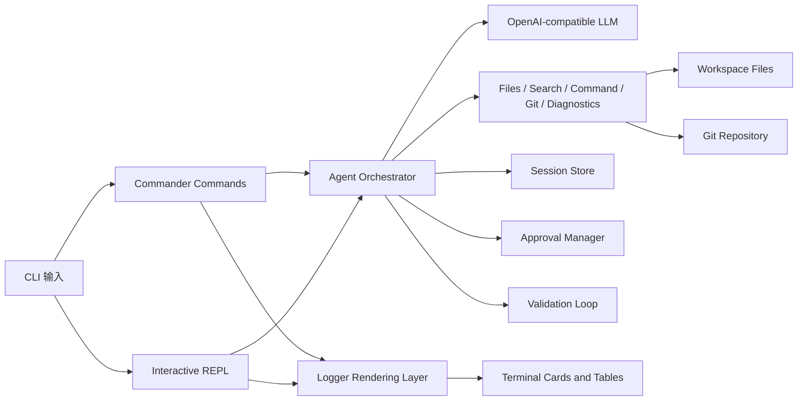
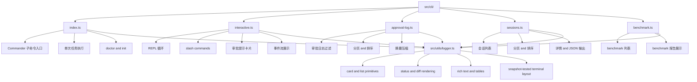
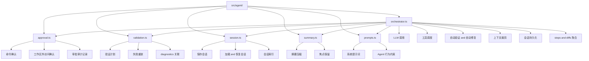
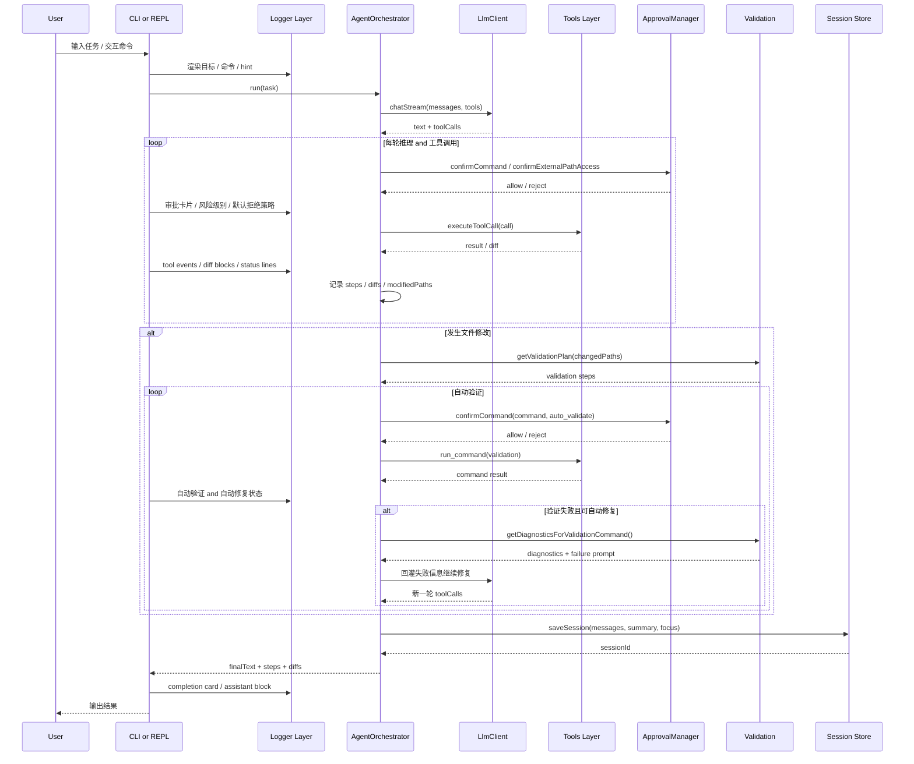
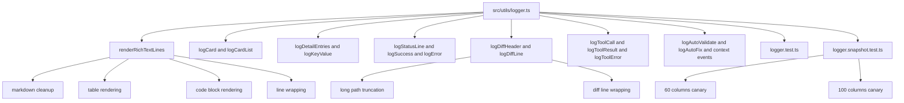

# Mini Claude Code

> 一个可本地安装、通过环境变量完成配置的本地 Code Agent CLI。

支持真实开发中的“搜索 → 读取 → 修改 → 验证 → 提交”闭环，面向终端、本地文件系统和 Git 仓库，而不是只会聊天的壳。


**技术栈**：TypeScript · Node.js (ESM) · OpenAI SDK（兼容协议）· Commander · Zod · Vitest

## 当前状态

- 已完成 CLI 打包、帮助信息、环境初始化、自检、交互会话与单次任务执行流程
- 已具备审批日志、会话恢复、benchmark、自动验证/自动修复闭环
- 已验证本地 tarball 安装、全局运行、首次使用闭环，以及主要 CLI 页面回归测试
- 已具备 GitHub Releases 可下载资产的自动上传 workflow
- 已新增 standalone 单文件可执行产物构建路径，与现有 npm/tarball 发布并行存在
- Release workflow 已支持按平台构建 standalone 资产（Linux / macOS / Windows）
- 当前推荐通过 GitHub Releases 下载 standalone 可执行文件、tarball，或直接运行源码仓库

## Highlights

- **Tool-calling Agent**：文件读写、全文搜索、命令执行、Git、diagnostics 全部纳入同一条 agent loop
- **Diagnostics-driven Auto-Fix**：修改后自动验证，并把 TypeScript / Biome / ESLint 结构化错误回灌给模型继续修复
- **Git-aware Workflow**：支持 `git status`、`git diff`、`git log`、`git add`、`git commit`
- **Session Resume**：支持多会话持久化、查看历史会话、按 ID 恢复上下文
- **Security-first Execution**：命令执行采用 allow / confirm / block 三级策略，并记录审批日志
- **Installable CLI**：已具备 `init` / `doctor` / `--version` / `--help` / 本地打包安装验证

## Demo at a glance

- 修改代码 → 自动触发验证 → diagnostics 回灌 → 自动修复
- 查看仓库状态 → 总结 diff → 暂存指定文件 → 生成提交
- 中断会话 → 查看历史会话 → 按 ID 恢复上下文继续执行

## 架构概览



## 深入结构图

### CLI / 渲染层结构



### Agent 层结构



### Agent / CLI 执行时序



### Validation 闭环

```mermaid
flowchart TD
    A[代码发生修改] --> B[getValidationPlan(changedPaths)]
    B --> C{修改类型}

    C -->|仅文档| D[跳过自动验证]
    C -->|测试变更| E[优先 lint + test]
    C -->|源码变更| F[优先 lint + build]
    C -->|配置/依赖变更| G[lint + test + build 全量验证]

    E --> H[尝试定向测试命令]
    F --> I[执行 lint/build]
    G --> J[执行完整验证计划]

    H --> K{定向测试是否受支持}
    K -->|否| L[回退到完整 test]
    K -->|是| M[执行受影响测试]

    M --> N{验证是否通过}
    L --> N
    I --> N
    J --> N

    N -->|通过| O[验证完成]
    N -->|失败| P[getDiagnosticsForValidationCommand]
    P --> Q[buildFailurePrompt]
    Q --> R[回灌给 Orchestrator / LLM]
    R --> S[最小修复代码]
    S --> T[重新执行验证]
    T --> U{是否达到自动修复上限}
    U -->|未达到| P
    U -->|达到| V[返回最终失败报告]
```

### Tools 层结构

```mermaid
flowchart TD
    A[src/tools/] --> B[filesystem.ts]
    A --> C[search.ts]
    A --> D[command.ts]
    A --> E[git.ts]
    A --> F[diagnostics.ts]
    A --> G[index.ts]

    B --> B1[list_files]
    B --> B2[read_file]
    B --> B3[create_file and write_file]
    B --> B4[append_text and insert_after and replace_text]
    B --> B5[import_external_file]

    C --> C1[search_text]
    C --> C2[project_map]

    D --> D1[run_command]
    D --> D2[allow and confirm and block]
    D --> D3[command audit integration]

    E --> E1[git_status]
    E --> E2[git_diff]
    E --> E3[git_log]
    E --> E4[git_add]
    E --> E5[git_commit]

    F --> F1[readTypeScriptDiagnostics]
    F --> F2[readLintDiagnostics]
    F --> F3[read_diagnostics]

    G --> H[tools array 聚合导出]
    B --> H
    C --> H
    D --> H
    E --> H
    F --> H
```



### 终端渲染层结构



## 快速开始

### 方式 1：通过 GitHub Releases 下载 standalone 可执行文件（推荐给最终用户）

在 GitHub Releases 页面下载当前平台对应的 standalone 可执行文件（例如 `mini-claude-code-linux-x64`、`mini-claude-code-darwin-arm64`、`mini-claude-code-win32-x64.exe`），然后直接运行：

**macOS / Linux**

```bash
chmod +x ./mini-claude-code
mkdir my-project
cd my-project
../mini-claude-code init
```

standalone 产物是当前平台专用的单文件可执行程序，不依赖 npm 全局安装；首次运行后，工作区、`.env` 与会话数据行为与正常安装版一致。源码仓库与现有 npm/tarball 发布路径保持不变，只是额外新增了一条并行分发方式。若本地 Node 发行版不支持 SEA 注入，可改在 GitHub Actions `setup-node` 环境执行 `npm run prepare:standalone:release` 产出带平台后缀的发布文件。

### 方式 2：通过 GitHub Releases 下载 tarball

在 GitHub Releases 页面下载对应版本的 `mini-claude-code-<version>.tgz`，然后本地安装：

**macOS / Linux**

```bash
npm install -g ./mini-claude-code-0.1.0.tgz
mkdir my-project
cd my-project
mini-claude-code init
```

**Windows PowerShell**

```powershell
npm install -g .\mini-claude-code-0.1.0.tgz
mkdir my-project
Set-Location my-project
mini-claude-code init
```

### 方式 3：本地打包后安装

```bash
npm install
npm run build
npm pack
npm install -g ./mini-claude-code-0.1.0.tgz
```

安装完成后，推荐**进入目标项目目录再运行**：

```bash
mkdir my-project
cd my-project
mini-claude-code init
mini-claude-code doctor --ping
mini-claude-code -i
```

如果你当前不在目标项目目录，也可以显式指定工作区：

```bash
mini-claude-code --cwd ~/work/my-project -i
mini-claude-code --cwd ~/work/my-project "分析当前项目结构"
```

### 方式 4：直接从源码仓库运行

```bash
git clone https://github.com/Tches-git/Mini-Code-Agent.git
cd Mini-Code-Agent
npm install
npm run build
npm link
mini-claude-code init
```

### 初始化配置

编辑 `.env`，至少填写：

```bash
OPENAI_API_KEY=your-api-key-here
# OPENAI_BASE_URL=https://api.openai.com/v1
# MODEL_NAME=gpt-5.4
```

然后执行环境自检：

```bash
mini-claude-code doctor
mini-claude-code doctor --ping
```

Windows 用户如果全局命令未立即生效，先重新打开 PowerShell，或确认 npm global bin 已加入 PATH。

### 工作区与用户数据

- CLI 默认以**当前终端所在目录**作为工作区
- 可通过 `--cwd <path>` 显式指定目标项目目录，避免误操作工具源码仓库
- sessions / approvals / 运行期状态默认保存到 `~/.mini-claude-code/`，按工作区隔离
- benchmark 运行也会遵循当前工作区；`temp_copy` 模式下会从该工作区创建隔离副本

## 常用命令

```bash
mini-claude-code --version
mini-claude-code --help
mini-claude-code init
mini-claude-code init --cwd ~/work/my-project
mini-claude-code doctor
mini-claude-code doctor --ping
mini-claude-code -i
mini-claude-code --cwd ~/work/my-project -i
mini-claude-code --cwd ~/work/my-project "分析当前项目结构"
mini-claude-code sessions --sort turns --limit 5
mini-claude-code session <id>
mini-claude-code approvals --decision rejected --after 7d --page 2
mini-claude-code benchmark --list
```

## 交互模式

支持以下斜杠命令：

| 命令 | 说明 |
|------|------|
| `/help` | 显示可用命令 |
| `/clear` | 清空上下文，开始新会话 |
| `/approvals [过滤]` | 查看审批日志，支持 `decision:` / `path:` / `page:` / `sort:` 等查询 |
| `/sessions` | 查看最近可恢复的历史会话 |
| `/resume <id>` | 恢复指定会话 |
| `/init` | 提示如何生成 `.env` 模板 |
| `/doctor` | 提示如何运行环境自检 |
| `/exit` | 退出 |

交互模式中的审批提示会展示：
- 风险级别（低 / 中 / 高）
- 默认策略（默认拒绝，需明确批准）
- 目标路径 / 原因 / 模式等结构化详情

## 核心能力

### 自动验证与自动修复

- 修改源码后自动推断验证计划，优先执行更小范围的 lint / test / build
- 测试文件变更时优先跑受影响测试，失败时自动回退到完整验证
- 验证失败时补充 TypeScript / Biome / ESLint 结构化 diagnostics 回灌模型
- Agent 会把失败信息、验证命令和 diagnostics 重新拼成修复上下文继续尝试
- 当前默认最多进行 2 轮自动修复

### 命令安全与审批

| 策略 | 行为 | 示例 |
|------|------|------|
| allow | 直接执行 | `ls`, `git status`, `npm run build` |
| confirm | 需要确认 | `npm install`, `git push`, 工作区外读写 |
| block | 直接拒绝 | `rm -rf`, `sudo`, `curl | sh` |

补充能力：
- 工作区外文件 / 目录访问需要显式批准
- 审批日志支持 query text、分页、排序（newest / oldest）和 JSON 输出
- 交互审批卡片会展示风险级别、默认拒绝策略与结构化详情

### 会话恢复

- 持久化多轮对话、摘要和焦点信息
- 支持查看最近会话列表
- 支持按 ID 恢复指定上下文继续工作
- 支持分页、排序（updated / created / turns）和摘要压缩显示

### 终端输出与可观测性

- 使用统一 logger 渲染 card、list、detail、status、diff、tool-event
- 支持 markdown-ish rich text、表格、code block、超长路径截断与 diff 换行
- 通过 snapshot canary 测试覆盖不同终端宽度下的关键布局

## 工具清单

| 工具 | 功能 |
|------|------|
| `list_files` / `read_file` | 读取工作区内容 |
| `create_file` / `write_file` / `append_text` / `insert_after` / `replace_text` | 受控修改文件 |
| `search_text` | 全文搜索（ripgrep 优先） |
| `project_map` | 生成轻量级代码结构图 |
| `import_external_file` | 导入并提取工作区外文档 |
| `run_command` | 受策略约束的命令执行，并写入审批审计 |
| `git_status` / `git_diff` / `git_log` / `git_add` / `git_commit` | Git 工作流 |
| `read_diagnostics` | 读取 TypeScript / Biome / ESLint 结构化错误 |

补充说明：
- `src/tools/index.ts` 负责把全部工具聚合给 orchestrator。
- `src/utils/command-audit.ts` 为命令与外部访问审批提供审计读写能力。

## 项目结构

```text
src/
  cli/        Commander 命令入口、交互 REPL、审批日志、sessions / benchmark 展示层
  agent/      Agent 编排、审批、安全策略、验证闭环、摘要与会话持久化
  benchmark/  benchmark 任务集、隔离执行与报告聚合
  llm/        OpenAI 兼容客户端与环境变量配置
  tools/      文件、搜索、命令、Git、diagnostics 工具实现与聚合导出
  types/      Agent / Tool 共享类型定义
  utils/      logger、diff、token、path、command-audit 等底层基础设施
```

补充说明：
- `src/utils/logger.ts` 是对外稳定 facade；具体渲染实现已拆到 `src/utils/logger/` 下的 core / rich-text / spinner 模块。
- `src/cli/index.ts` 是统一 CLI 入口，`src/cli/interactive.ts` 负责 REPL 体验。
- `src/agent/orchestrator.ts` 保持编排入口职责，细分逻辑拆到 `src/agent/orchestrator-*.ts`。
- 终端 UI 设计约束与边界记录在 `docs/architecture/terminal-ui.md`。

## 工程化

```bash
npm test
npm run build
npm run build:standalone
npm run build:standalone:gha
npm run prepare:standalone:release
npm run lint
npm run check
npm run pack:check
npm run pack:verify
npm run release:check:standalone
npm run benchmark -- --list
```

当前项目包含：
- 单元测试 / CLI 回归测试
- logger 终端快照测试（`src/utils/logger.snapshot.test.ts`）
- benchmark 与隔离执行测试

已经完成的真实验证：

- `npm pack`
- 本地 `npm install -g ./mini-claude-code-0.1.0.tgz`
- `npm run build:standalone`
- `npm run build:standalone:gha`
- `npm run prepare:standalone:release`
- `./dist/standalone/mini-claude-code --version`
- `mini-claude-code --version`
- `mini-claude-code doctor --json`
- `mini-claude-code doctor --ping`
- 全新空目录首次使用流程：`init` → `doctor --ping`
- Release workflow 已可在 GitHub Release 中上传 `.tgz` 资产

## Benchmark

项目内置 benchmark / eval 框架，覆盖只读分析、受限编辑、局部重命名和 diagnostics 驱动自动修复等任务；CLI 默认使用 `temp_copy` 隔离副本运行 benchmark。

当前 benchmark CLI 支持：
- `--list` 查看任务清单
- `--task` 只运行指定任务
- `--json` 输出结构化报告
- `--isolation-mode in_place|temp_copy`
- `--keep-isolated-workspace` 保留隔离副本便于排查
- 汇总输出包括通过率、分类统计、skip 原因和逐任务详情
- 在指定工作区运行时，可配合 `mini-claude-code --cwd <path> benchmark ...` 使用

```bash
npm run benchmark -- --list
npm run benchmark
npm run benchmark -- --isolation-mode temp_copy
npm run benchmark -- --task project-structure-overview --task validation-loop --json
```

## 适合简历的项目描述

> 实现了一个本地代码 Agent CLI，支持文件与搜索工具调用、安全审批、自动验证修复，并进一步接入 Git 工作流、结构化 diagnostics 和多会话恢复能力，使其更接近真实开发场景中的工程助手。
