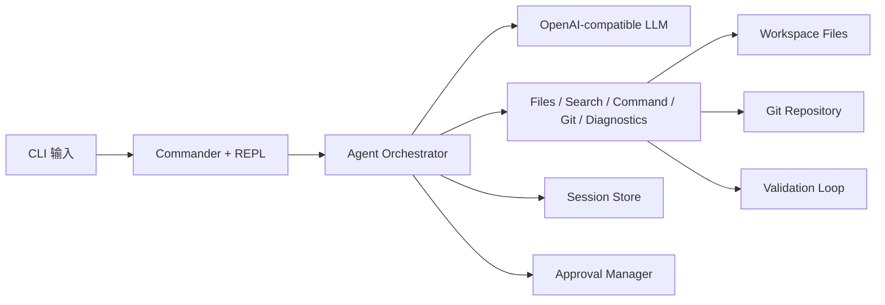

# Mini Claude Code

> 一个可本地安装、通过环境变量完成配置的本地 Code Agent CLI。

支持真实开发中的“搜索 → 读取 → 修改 → 验证 → 提交”闭环，面向终端、本地文件系统和 Git 仓库，而不是只会聊天的壳。


**技术栈**：TypeScript · Node.js (ESM) · OpenAI SDK（兼容协议）· Commander · Zod · Vitest

## 当前状态

- 已完成 CLI 打包、帮助信息、环境初始化与自检流程
- 已验证本地 tarball 安装、全局运行和首次使用闭环
- 当前推荐通过 GitHub 源码仓库或本地 tarball 安装使用

## Highlights

- **Tool-calling Agent**：文件读写、全文搜索、命令执行、Git、diagnostics 全部纳入同一条 agent loop
- **Diagnostics-driven Auto-Fix**：修改后自动验证，并把 TypeScript / Biome 结构化错误回灌给模型继续修复
- **Git-aware Workflow**：支持 `git status`、`git diff`、`git log`、`git add`、`git commit`
- **Session Resume**：支持多会话持久化、查看历史会话、按 ID 恢复上下文
- **Security-first Execution**：命令执行采用 allow / confirm / block 三级策略，并记录审批日志
- **Installable CLI**：已具备 `init` / `doctor` / `--version` / `--help` / 本地打包安装验证

## Demo at a glance

- 修改代码 → 自动触发验证 → diagnostics 回灌 → 自动修复
- 查看仓库状态 → 总结 diff → 暂存指定文件 → 生成提交
- 中断会话 → 查看历史会话 → 按 ID 恢复上下文继续执行

## 架构概览



## 快速开始

### 方式 1：通过本地打包结果安装（当前推荐）

先在源码仓库中打包：

```bash
npm install
npm run build
npm pack
```

然后安装生成的 tarball：

**macOS / Linux**

```bash
npm install -g ./mini-claude-code-0.1.0.tgz
mkdir my-project
cd my-project
mini-claude-code init
```

**Windows PowerShell**

```powershell
npm install -g .\mini-claude-code-0.1.0.tgz
mkdir my-project
Set-Location my-project
mini-claude-code init
```

### 方式 2：直接从源码仓库运行

```bash
git clone https://github.com/Tches-git/Mini-Code-Agent.git
cd Mini-Code-Agent
npm install
npm run build
npm link
mini-claude-code init
```

### 初始化配置

编辑 `.env`，至少填写：

```bash
OPENAI_API_KEY=your-api-key-here
# OPENAI_BASE_URL=https://api.openai.com/v1
# MODEL_NAME=gpt-5.4
```

然后执行环境自检：

```bash
mini-claude-code doctor
```

Windows 用户如果全局命令未立即生效，先重新打开 PowerShell，或确认 npm global bin 已加入 PATH。

## 常用命令

```bash
mini-claude-code --version
mini-claude-code --help
mini-claude-code init
mini-claude-code doctor
mini-claude-code -i
mini-claude-code "分析当前项目结构"
mini-claude-code sessions
mini-claude-code approvals --decision rejected --after 7d
```

## 交互模式

支持以下斜杠命令：

| 命令 | 说明 |
|------|------|
| `/help` | 显示可用命令 |
| `/clear` | 清空上下文，开始新会话 |
| `/approvals [过滤]` | 查看审批日志 |
| `/sessions` | 查看最近可恢复的历史会话 |
| `/resume <id>` | 恢复指定会话 |
| `/init` | 提示如何生成 `.env` 模板 |
| `/doctor` | 提示如何运行环境自检 |
| `/exit` | 退出 |

## 核心能力

### 自动验证与自动修复

- 修改源码后自动决定要跑哪些验证脚本
- 测试文件变更时优先跑受影响测试
- 定向测试不受支持时自动回退到完整 `test`
- 验证失败时补充 TypeScript / Biome 结构化 diagnostics
- 最多进行 2 轮自动修复

### 命令安全策略

| 策略 | 行为 | 示例 |
|------|------|------|
| allow | 直接执行 | `ls`, `git status`, `npm run build` |
| confirm | 需要确认 | `npm install`, `git push` |
| block | 直接拒绝 | `rm -rf`, `sudo`, `curl | sh` |

### 会话恢复

- 持久化多轮对话、摘要和焦点信息
- 支持查看最近会话列表
- 支持按 ID 恢复指定上下文继续工作

## 工具清单

| 工具 | 功能 |
|------|------|
| `list_files` / `read_file` | 读取工作区内容 |
| `create_file` / `write_file` / `append_text` / `insert_after` / `replace_text` | 受控修改文件 |
| `search_text` | 全文搜索（ripgrep 优先） |
| `project_map` | 生成轻量级代码结构图 |
| `import_external_file` | 导入并提取工作区外文档 |
| `run_command` | 受策略约束的命令执行 |
| `git_status` / `git_diff` / `git_log` / `git_add` / `git_commit` | Git 工作流 |
| `read_diagnostics` | 读取 TypeScript / Biome 结构化错误 |

## 项目结构

```text
src/
  cli/      CLI 入口与交互层
  agent/    Agent 编排、审批、验证、会话恢复
  llm/      OpenAI 兼容通信层
  tools/    文件、搜索、命令、Git、diagnostics 工具
  utils/    diff、token、logger、审计等基础设施
```

## 工程化

```bash
npm test
npm run build
npm run lint
npm run check
npm run pack:check
npm run pack:verify
```

已经完成的真实验证：

- `npm pack`
- 本地 `npm install -g ./mini-claude-code-0.1.0.tgz`
- `mini-claude-code --version`
- `mini-claude-code doctor --json`
- 全新空目录首次使用流程：`init` → `doctor`

## Benchmark

项目内置 benchmark / eval 框架，覆盖只读分析、受限编辑、局部重命名和 diagnostics 驱动自动修复等任务。

```bash
npm run benchmark -- --list
npm run benchmark
npm run benchmark -- --task project-structure-overview --task validation-loop --json
```

## 适合简历的项目描述

> 实现了一个本地代码 Agent CLI，支持文件与搜索工具调用、安全审批、自动验证修复，并进一步接入 Git 工作流、结构化 diagnostics 和多会话恢复能力，使其更接近真实开发场景中的工程助手。
