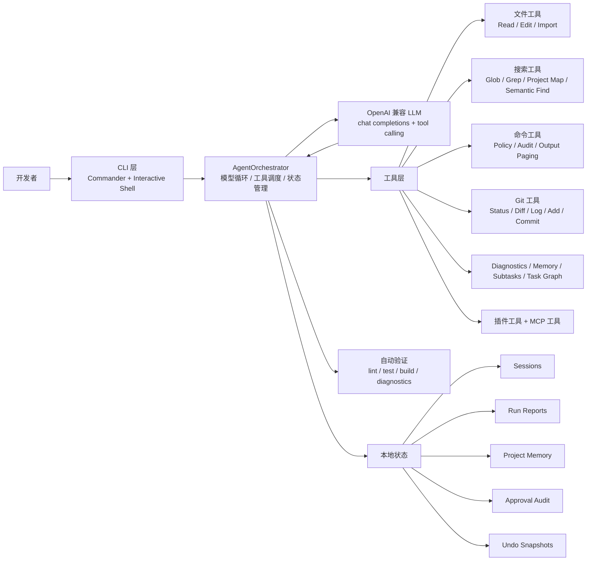
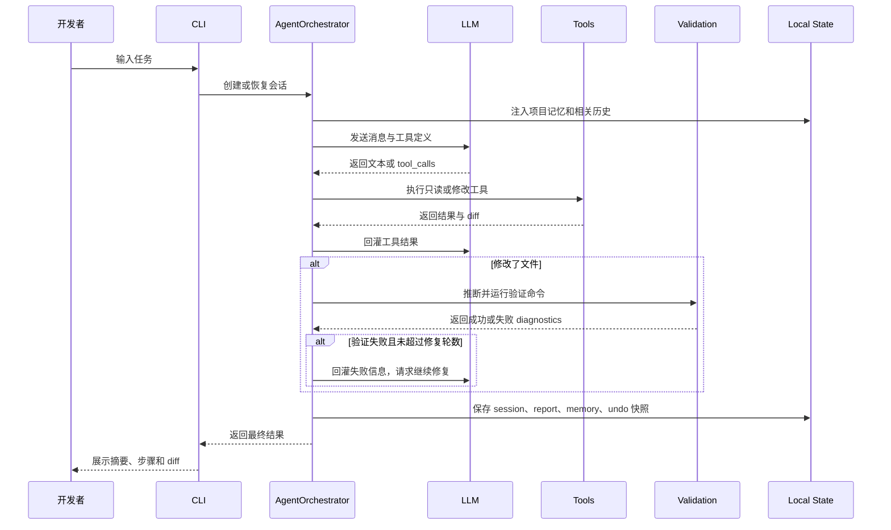

# Local Code Agent

一个本地运行的代码 Agent CLI。它能在你的项目里理解结构、搜索代码、读写文件、执行受控命令、查看 Git diff，并在修改后自动选择 lint / test / build 做验证。


Local Code Agent 的目标不是做一个聊天壳，而是把「理解项目 -> 计划 -> 修改 -> 验证 -> 报告 -> 可撤销」串成一个可靠的本地开发循环。

## 目录

- [核心能力](#核心能力)
- [快速开始](#快速开始)
- [使用方式](#使用方式)
- [交互命令](#交互命令)
- [架构总览](#架构总览)
- [执行流程](#执行流程)
- [项目结构](#项目结构)
- [工具能力](#工具能力)
- [配置](#配置)
- [扩展机制](#扩展机制)
- [安全模型](#安全模型)
- [开发与发布](#开发与发布)

## 核心能力

| 能力 | 说明 |
| --- | --- |
| 交互式代码助手 | `local-code-agent -i` 进入长期会话，支持 slash 命令、上下文恢复和多行输入。 |
| 单次任务执行 | `local-code-agent "修复这个测试"` 直接对当前项目执行一次任务。 |
| 项目理解 | 通过 `tree_files`、`project_map`、`semantic_find`、`glob_files` 和 `search_text` 快速定位代码。 |
| 精准编辑 | 支持创建文件、整文件写入、追加、锚点插入、文本替换和按行范围替换。 |
| 自动验证 | 修改后自动推断 lint / test / build，失败时读取 diagnostics 并尝试继续修复。 |
| 审批与审计 | 高风险命令、工作区外路径和外部文件导入需要确认，并写入审批日志。 |
| 会话与记忆 | 保存历史上下文、任务树、长期项目记忆，可按会话 ID 恢复。 |
| 撤销与审查 | 支持 `/review` 按文件接受或回滚，`/undo` 撤销最近一轮 Agent 修改。 |
| 运行报告 | 每次 Agent 运行可生成报告，支持 `/reports` 或 `local-code-agent reports` 查看。 |
| 扩展工具 | 支持项目级插件工具和 MCP stdio server 工具。 |
| 隔离执行 | 单次任务可通过 `--sandbox` 在临时 Git worktree 中执行，主工作区保持干净。 |

## 快速开始

### 从源码安装

```bash
git clone https://github.com/Tches-git/Mini-Code-Agent.git local-code-agent
cd local-code-agent
npm install
npm run build
npm link
```

### 从 tarball 安装

```bash
npm install -g ./local-code-agent-0.1.0.tgz
```

### 初始化目标项目

在你想让 Agent 工作的项目目录里运行：

```bash
local-code-agent init
```

编辑生成的 `.env`：

```bash
OPENAI_API_KEY=your-api-key
# OPENAI_BASE_URL=https://api.openai.com/v1
# MODEL_NAME=gpt-5.4
```

检查环境：

```bash
local-code-agent doctor
local-code-agent doctor --ping
```

## 使用方式

### 交互模式

```bash
local-code-agent -i
```

### 执行一次任务

```bash
local-code-agent "分析当前项目结构，并指出最值得改进的地方"
local-code-agent "修复 TypeScript 错误并验证"
```

### 指定工作区

```bash
local-code-agent --cwd ~/work/my-project -i
local-code-agent --cwd ~/work/my-project "补齐 README 的使用说明"
```

### 自动确认受保护命令

```bash
local-code-agent -y "运行测试并修复失败用例"
```

### 在隔离 worktree 中执行

```bash
local-code-agent --sandbox "重构 validation 逻辑"
local-code-agent --sandbox --keep-sandbox "尝试升级构建配置"
```

## 交互命令

| 命令 | 说明 |
| --- | --- |
| `/help` | 查看可用命令。 |
| `/plan <task>` | 只读探索并生成执行计划，不修改文件。 |
| `/execute [task]` | 执行最近一次计划，或执行指定任务。 |
| `/execute-task <id>` | 继续执行任务树中的指定节点。 |
| `/retry-task` | 自动重试第一个依赖已满足的阻塞任务。 |
| `/diff [--staged] [path]` | 查看当前 Git diff，可限定 staged 或路径。 |
| `/status` | 查看工作区、会话、撤销栈和 Git 状态。 |
| `/config` | 查看模型、环境、验证策略和命令策略配置。 |
| `/review` | 审查最近一次 Agent 修改，可按文件接受或回滚。 |
| `/undo` | 撤销 Agent 最近一次文件修改。 |
| `/tasks [timeline]` | 查看上一轮任务步骤，`timeline` 显示状态时间线。 |
| `/memory [review\|clear\|remove <id>\|overview <text>]` | 查看、预览、确认/拒绝或编辑项目长期记忆。 |
| `/approvals [active\|clear]` | 查看审批日志或当前任务临时审批。支持 `decision:`、`action:`、`path:`、`after:` 等过滤。 |
| `/reports [id]` | 查看 Agent 运行报告列表或详情。 |
| `/sessions` | 查看可恢复的历史会话。 |
| `/resume <id>` | 恢复指定会话 ID 的上下文。 |
| `/clear` | 清空当前对话上下文。 |
| `/exit` | 退出交互模式。 |

## 架构总览



## 执行流程



## 项目结构

```text
src/
  cli/          CLI 入口、交互模式、sessions、approvals、reports、benchmark
  agent/        Agent 编排、审批、验证、会话、摘要、任务图、撤销、报告
  tools/        文件、搜索、命令、Git、diagnostics、memory、subtask、MCP、插件
  llm/          OpenAI 兼容客户端和环境配置
  benchmark/    内置 benchmark 任务和隔离运行时
  release/      standalone 构建与 sandbox worktree 工作流
  types/        Agent、CLI、LLM 的共享类型
  utils/        logger、diff、path、token、runtime、project-tooling 等基础工具

docs/
  architecture/terminal-ui.md
  optimization-roadmap.md
  release-checklist.md
  code-agent-gap-analysis.md

scripts/
  prepare-standalone-release.mjs
  verify-standalone.mjs
```

## 工具能力

| 分类 | 工具 |
| --- | --- |
| 文件 | `list_files`、`tree_files`、`read_file`、`inspect_file`、`import_external_file`、`create_file`、`write_file`、`append_text`、`insert_after`、`replace_range`、`replace_text` |
| 搜索 | `glob_files`、`search_text`、`project_map`、`semantic_find` |
| 命令 | `run_command`、`read_command_output` |
| Git | `git_status`、`git_diff`、`git_log`、`git_add`、`git_commit` |
| Diagnostics | `read_diagnostics` |
| 记忆 | `project_memory` |
| 子任务 | `task`、`task_batch` |
| 任务图 | `update_tasks` |
| 扩展 | `.local-code-agent/tools/*.ts` 插件工具、`.local-code-agent/mcp.json` MCP 工具 |

## 配置

### `.env`

`local-code-agent init` 会生成模板：

```bash
OPENAI_API_KEY=your-api-key-here
OPENAI_BASE_URL=https://api.openai.com/v1
MODEL_NAME=gpt-5.4

# 额外允许的命令规则，支持精确匹配或前缀 *
# RUN_COMMAND_ALLOWLIST=node *;npm run storybook

# 强制要求确认的命令规则
# RUN_COMMAND_GUARDLIST=pnpm install*;git push*

# 额外阻止的命令规则
# RUN_COMMAND_BLOCKLIST=npx *

# 审批日志输出路径
# RUN_COMMAND_AUDIT_LOG_PATH=.local-code-agent/command-approvals.ndjson
```

### 状态目录

默认状态会写入用户数据目录：

```text
~/.local-code-agent/workspaces/<workspace-name>-<hash>/
  sessions/
  reports/
  command-approvals.ndjson
  semantic-index/
  semantic-vectors/
```

测试或 CI 中建议显式指定临时状态目录：

```bash
LOCAL_CODE_AGENT_STATE_DIR=/tmp/local-code-agent-state npm test
```

## 扩展机制

### 项目插件工具

把工具文件放到目标项目的 `.local-code-agent/tools/` 下。`.ts` 插件会被转译到 `.local-code-agent/.tools-build/`，构建后的 CLI 会通过独立 Node 进程运行插件。

```ts
// .local-code-agent/tools/hello.ts
export default {
  name: "hello_tool",
  description: "返回一段问候文本",
  readOnly: true,
  inputSchema: {
    type: "object",
    properties: {
      name: { type: "string" },
    },
    required: ["name"],
  },
  async execute(input) {
    return `Hello, ${input.name}`;
  },
};
```

插件约束：

- 工具名需为 3 到 49 位小写字母、数字或下划线，不能覆盖内置工具。
- 默认按只读工具处理，设置 `modifiesFiles: true` 后会进入修改工具链。
- 构建后的插件默认 30 秒超时。

### MCP 工具

在目标项目中创建 `.local-code-agent/mcp.json`：

```json
{
  "servers": {
    "local_docs": {
      "command": "node",
      "args": ["./scripts/mcp-docs-server.js"],
      "env": {
        "DOCS_ROOT": "./docs"
      }
    }
  }
}
```

MCP server 暴露的工具会以 `mcp_<server>_<tool>` 形式加入工具列表。若工具声明 `readOnlyHint: true` 且没有 `destructiveHint: true`，会被视为只读并允许并行执行。

## 安全模型

Local Code Agent 默认把工作区作为安全边界：

| 场景 | 行为 |
| --- | --- |
| 工作区内读写 | 允许，但修改工具会产生 diff 和 undo 快照。 |
| 工作区外路径 | 需要用户确认，确认后才会传入 `confirmed: true`。 |
| 外部文档导入 | 通过 `import_external_file` 缓存到 `.imports/`，Office、OpenDocument、PDF 等尽量提取文本。 |
| 命令执行 | `run_command` 会根据内置策略、项目配置和环境变量判断 allow / confirm / block。 |
| 危险命令 | `rm`、`sudo`、`shutdown`、网络远程命令、shell 管道/重定向等默认阻止或要求确认。 |
| 审批记录 | 命令、外部文件和外部路径审批会写入 `command-approvals.ndjson`。 |
| 自动验证 | 验证命令也走审批策略，不绕过用户确认。 |

## CLI 命令速查

| 命令 | 用途 |
| --- | --- |
| `local-code-agent init` | 生成 `.env` 模板。 |
| `local-code-agent doctor [--ping]` | 检查 Node、`.env`、API key、模型和 tool-calling 连通性。 |
| `local-code-agent -i` | 进入交互模式。 |
| `local-code-agent "task"` | 执行一次自然语言任务。 |
| `local-code-agent approvals` | 查询审批日志，支持过滤和统计。 |
| `local-code-agent reports [id]` | 查看运行报告列表或详情。 |
| `local-code-agent sessions` | 查看可恢复会话。 |
| `local-code-agent session <id>` | 查看某个会话详情。 |
| `local-code-agent benchmark` | 运行内置 benchmark。 |
| `local-code-agent release:standalone` | 构建当前平台 standalone 单文件可执行产物。 |
| `local-code-agent sandbox:apply <patch>` | 预检或应用 sandbox 产出的 patch。 |
| `local-code-agent sandbox:pr-draft <patch>` | 根据 sandbox patch 生成 PR 标题和描述草稿。 |
| `local-code-agent sandbox:branch <patch> <branch>` | 基于 sandbox patch 创建隔离分支 worktree。 |

## 开发与发布

### 常用开发命令

```bash
npm test
npm run lint
npm run build
npm run check
```

### Benchmark

```bash
npm run benchmark:smoke
npm run benchmark:smoke:mock
```

### npm 包与 standalone

```bash
npm run pack:verify
npm run build:standalone
npm run release:check
```

### 本仓库当前验证状态

最近一次本地验证：

```text
npm run lint   PASS
npm run build  PASS
npm test       530 tests passed
```

在受限环境中运行测试时，建议像这样指定状态目录：

```bash
LOCAL_CODE_AGENT_STATE_DIR=/private/tmp/local-code-agent-test-state npm test
```

## License

MIT
